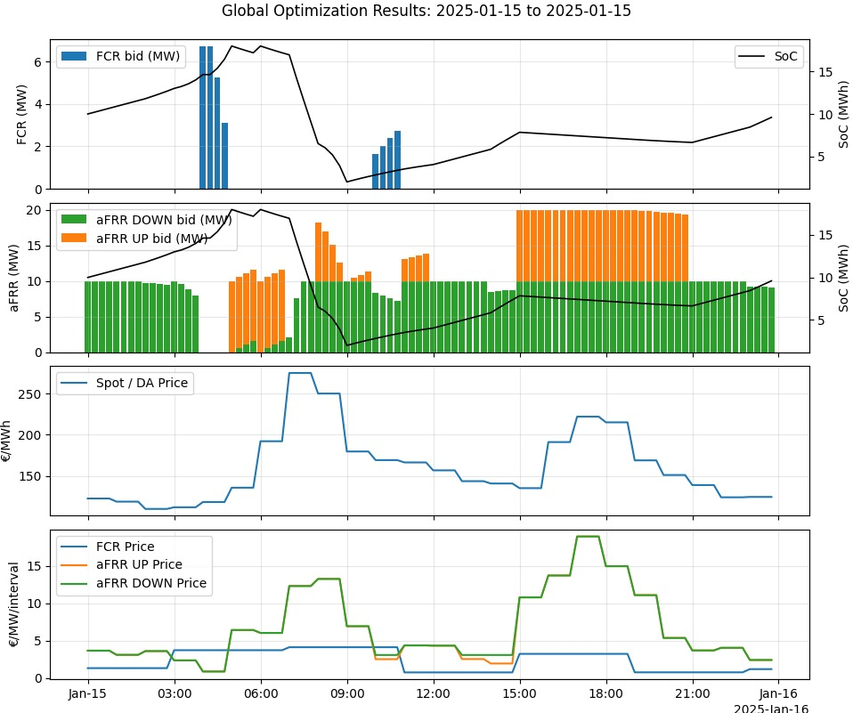

# Co-Optimization of Battery Storage Between Energy Arbitrage and Frequency Reserve Markets

This repository implements a **deterministic (perfect-foresight) day-ahead co-optimization** of a Battery Energy Storage System (BESS) between:
- **Day-Ahead (DA) energy arbitrage**,
- **FCR** (primary frequency reserve, symmetric),
- **aFRR** (secondary automatic reserve, **UP** / **DOWN** products).

The goal is to compute, **day by day**, an optimal schedule (SoC, charge/discharge, reserve bids) on a **15-minute grid** while respecting battery and reserve feasibility constraints.  

This work is largely inspired by a reference thesis used throughout the project :
"Optimizing Residential Battery Energy Storage Systems Across Frequency Regulation Markets and Energy Arbitrage" by **Elias Schuhmacher** and **Eric Rosen** wrote in 2025.

---
## Main Results :

### Optimized D+1 Schedule
An example of a day-ahead optimized schedule (January 15, 2021):


### Strategies PnL Details
Details of three strategies PnL (January 15, 2021):


### Strategies daily PnL
Comparison of three strategies PnL over January:


---

## Problem context

A BESS can earn:
    
- **Energy arbitrage**: charge low, discharge high.
- **Reserve capacity payments**: get paid for being available to provide frequency control (even if not activated).

Because energy and reserve share the same **power (MW)** and **energy (MWh)** limits, the trade-off is non-trivial: allocating headroom to reserves may reduce arbitrage, and aggressive arbitrage may violate reserve deliverability.

---

## Data 

Two public datasets are used:
- **French day-ahead prices** (from Ember) originally **hourly**, in €/MWh.
- **French balancing capacity remuneration** (from RTE Services) **15-min**, in €/MW/15min.

Please find the links to the data below:
- https://ember-energy.org/data/european-wholesale-electricity-price-data
- https://www.services-rte.com/fr/telechargez-les-donnees-publiees-par-rte.html?category=market&type=balancing_capacity&subType=procured_reserves

We operate everything on a **UTC 15-minute grid** (96 steps/day). DA hourly prices are expanded to 15-min as piecewise-constant; reserve products are kept for **FCR**, **aFRR_UP**, **aFRR_DOWN**; small gaps are forward-filled. Processed datasets are stored as compact **Parquet** files for fast reproducibility in the repo (data directory).

---

## Battery model

We follow a standard battery model (SoC dynamics + power/energy constraints), grounded in the reference thesis and adapted to an industrial/utility scale.  

Typical parameters used in experiments:
- **Power**: 10 MW  
- **Energy**: 20 MWh
- **SoC bounds**: 10% – 90%  
- **Efficiencies**: 90% per conversion step  
- **Degradation proxy**: linear throughput penalty, ~15 €/MWh

---

## Tradable assets

We consider three products settled on the same 15-min grid:
- **Energy (DA)**: scheduled charging/discharging at price $\pi_t$ (€/MWh)
- **FCR capacity**: symmetric reserve, assumed **net SoC impact ~ 0** on average (but consumes power headroom)
- **aFRR capacity**: UP/DOWN products, modeled with a simplified activation mechanism

---

## Optimization problem

We solve one optimization per day with:
- $T = 96$ time steps, $\Delta t = 0.25$ hours
- initial SoC $S_0$ coming from the previous day (optional multi-day linking)

### Decision variables (per interval t)
- $P_t^{ch} \ge 0$, $P_t^{dis} \ge 0$ : charge/discharge power (MW)
- $R_t^{fcr} \ge 0$ : FCR capacity (MW)
- $R_t^{up} \ge 0$, $R_t^{down} \ge 0$ : aFRR UP/DOWN capacity (MW)
- $A_t^{up} \ge 0$, $A_t^{down} \ge 0$ : aFRR activation power (MW)
- $S_t$ : state-of-charge (MWh)

### Objective


$\text{Revenues}=\sum_{t=1}^{T}\Big[\pi_t\,(P_t^{dis}-P_t^{ch})\,\Delta t +\rho_t^{fcr}R_t^{fcr} +\rho_t^{up}R_t^{up} +\rho_t^{down}R_t^{down} \Big]$

$\text{Costs}=\sum_{t=1}^{T} c_{th}\,(P_t^{ch}+P_t^{dis})\,\Delta t$

$\max \ \text{Profit}=\max\big(\text{Revenues}-\text{Costs}\big)$

---

## Key constraints

### 1) SoC dynamics + bounds
$S_{t+1}=S_t+\eta_{ch}(P_t^{ch}+A_t^{down})\Delta t -\frac{1}{\eta_{dis}}(P_t^{dis}+A_t^{up})\Delta t$

$S_{\min}\le S_t \le S_{\max}\qquad\forall t$

### 2) Power limits + reserve headroom

Directional aFRR consumes headroom in the corresponding direction:
$P_t^{dis}+R_t^{up}\le P_{\max}^{dis},\qquad P_t^{ch}+R_t^{down}\le P_{\max}^{ch}$

For FCR, we enforce symmetric deliverability (headroom in both directions):
$P_t^{dis}+R_t^{up}+\gamma R_t^{fcr}\le P_{\max}^{dis},\qquad P_t^{ch}+R_t^{down}+\gamma R_t^{fcr}\le P_{\max}^{ch}$

### 3) Activation feasibility + activation ratios (aFRR)

Activation cannot exceed capacity:
$0\le A_t^{up}\le R_t^{up},\qquad 0\le A_t^{down}\le R_t^{down}$

We enforce a uniform activation in time with 25% activation ratios ($\alpha_{up}=0.25$, $\alpha_{down}=0.25$) :
$\sum_{t=1}^{T}A_t^{up}=\alpha_{up}\sum_{t=1}^{T}R_t^{up},\qquad \sum_{t=1}^{T}A_t^{down}=\alpha_{down}\sum_{t=1}^{T}R_t^{down}$

### 4) Energy buffer

Upward reserve requires enough energy above $S_{\min}$, downward reserve requires enough empty space below $S_{\max}$:
$S_t \ge S_{\min}+(\gamma R_t^{fcr}+R_t^{up})\,\tau,\qquad S_t \le S_{\max}-(\gamma R_t^{fcr}+R_t^{down})\,\tau$

with $\tau$ a deliverability horizon (here 15 minutes).

### 5) Optional multi-day linking
$S^{(d+1)}_0=S^{(d)}_T$

---

## Implementation

- **Python + CVXPY** formulation
- Solved as a **linear program**, using **ECOS** solver
- Modular, object-oriented structure:
  - `Battery` stores technical parameters
  - `DaySolver` solves one day
  - `DaySolution` stores schedule + metrics + status
  - `Orchestrator` runs day-by-day and aggregates results

---

## Quickstart

> This repo is `uv`-friendly !

```bash
# 1) Create venv
uv venv .venv
.venv\Scripts\activate

# 2) Install dependencies
uv sync

# 3) Run
uv run python main.py

